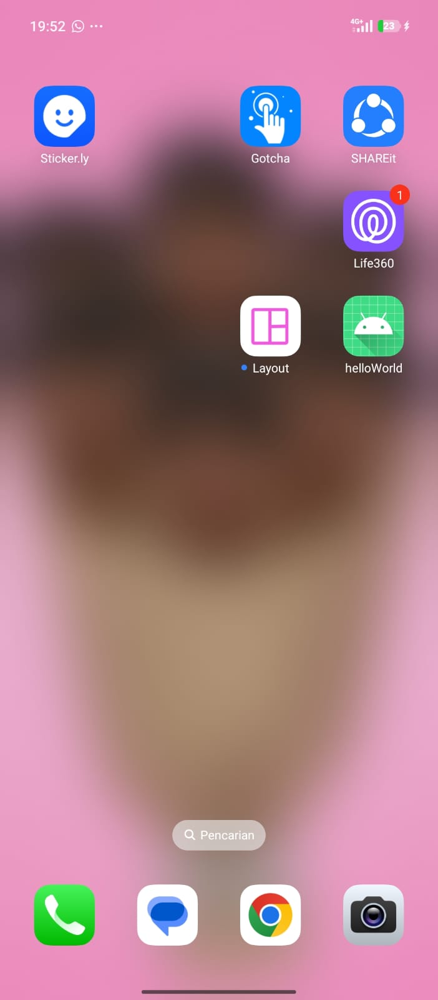
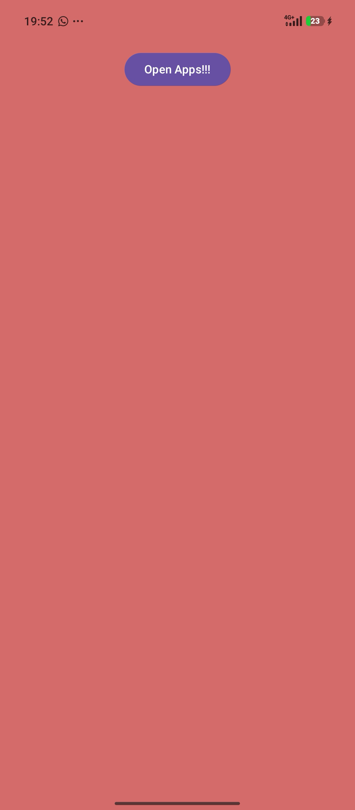
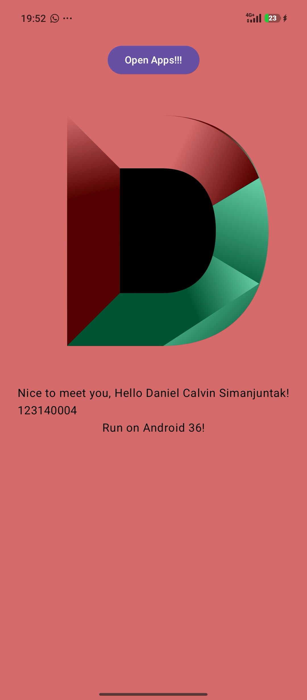
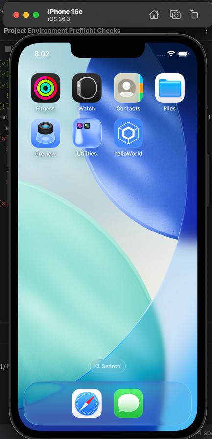
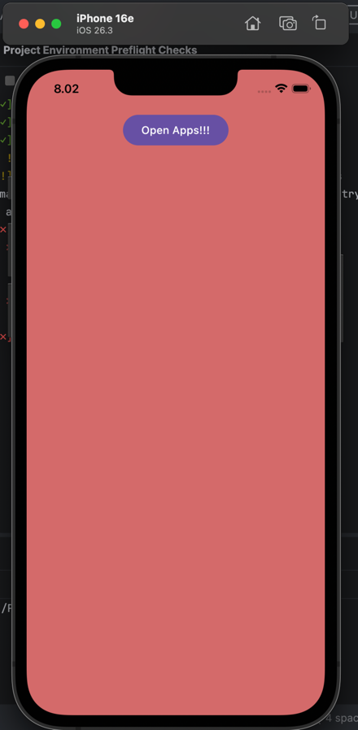
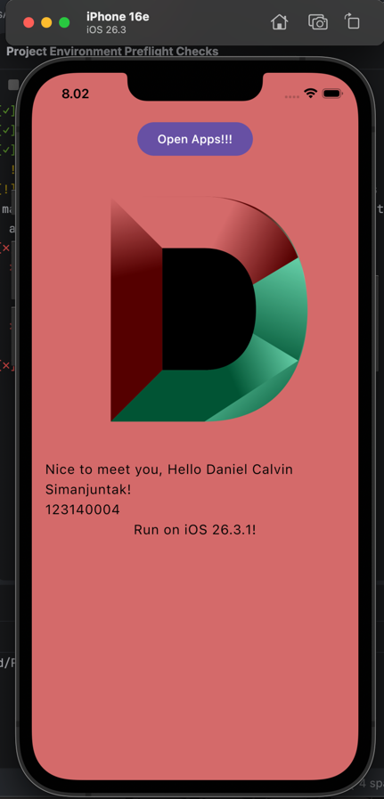

# Tugas 1 Praktikum
## Daniel Calvin Simanjuntak
## 123140004

---

### Running the apps

Use the run configurations provided by the run widget in your IDE's toolbar. You can also use these commands and
options:

- Android app: `./gradlew :androidApp:assembleDebug`
- iOS app: open the [/iosApp](./iosApp) directory in Xcode and run it from there.

### Running tests

Use the run button in your IDE's editor gutter, or run tests using Gradle tasks:

- Android tests: `./gradlew :shared:testAndroidHostTest`
- iOS tests: `./gradlew :shared:iosSimulatorArm64Test`

---
### Screenshots
#### Android

| 1. Home Screen | 2. First Opened | 3. Clicked |
| :---: | :---: | :---: |
|  |  |  |

#### iOS

| 1. Home Screen | 2. First Opened | 3. Clicked |
| :---: | :---: | :---: |
|  |  |  |